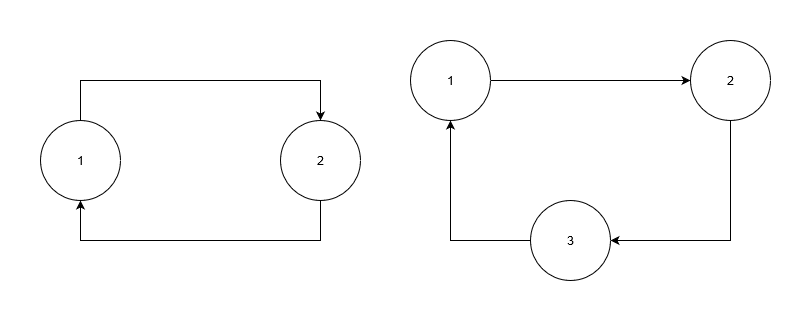
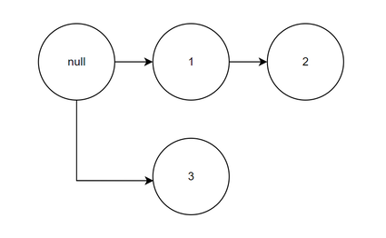
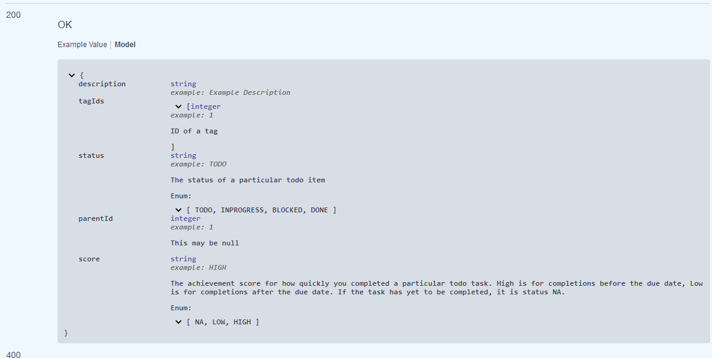

# COMP1531 Take-home Project

**✨ ☑️ DoToo ☑️ ✨**

## Contents

[[_TOC_]]

## Change Log

Thursday:
* 12:00pm: clarifications on passing `null` parameters and other hints
  * Clarify /todo/list how `null`` tagids are passed in.
  * Clarify item itself is not included in check of unique description for PUT `/todo/item`.
  * **Add section 1.5 to clarify way `null` is passed in requests.**
  * Add section 3.1 improving code confidence.
  * Add note that configuration comments disabling eslint and tsc are not allowed.
  * Clarify dryrun run instructions. Add debug hints.
  * Add the extended deadline and clarify deadline which extensions are applied upon.
* 8:30pm:
  * clarified example return in GET /notifications to fix swagger defaults

Wednesday:
 * 12:00 pm: quality of life improvements
   * changed linting command `npm run lint` command to be `npm run lint .`. (IMPORTANT!)
   * Added section on undefined behaviour.
   * added to FAQ.
   * clarified that there are a maximum of 50 todo items in the system.
   * clarified that the converse of editing only the status is true - you should use the old deadline to calculate the score.
   * fix typo of `name` -> `description` in `todo/item/bulk`

Tuesday:
 * 3:00 pm: clarifications on how cycles work
   * create FAQ for common questions
   * updated cycles to not include null, as the null node cannot be involved in a cycle.
   * Clarified `tagIds` instead of `tags`.
 * 4:00 pm: clarifications on how `status` and `deadline` interplay
   * Updated `PUT /todo/item` to allow a `null` `deadline` and a `deadline` in the past. 
   * made the implicit invalid `parentId` error explicit in `PUT /todo/item`.
   * Clarified `status` description.
   * Updated FAQ.
 * 7:30pm: clarified that `DELETE /todo/item` continues until all children, sub-children, sub-sub-children, etc, of the deleted node are deleted.

## 🌈 0. Overview

To-do lists can sometimes be a little bit underwhelming. The simple applications never do enough, and the ones that do enough are often too hard to use. In light of this, we'd like you to build a server backend for a todo list app for us known as **DoToo**. **DoToo** contains the ability to link a todo item to a parent item, as well as add tags to do list items, and much more.

## 🛠 1. The Task

Your task is to:

-   Build a **typescript** web server that implements the interface defined in `swagger.yaml` (view [here](swagger.yaml)).
-   Write appropriate **tests** with complete **coverage** of your implementation.
-   Ensure that your code is **linted** in accordance with provided linting config.

### 😇 1.1. Recommended Approach
We recommend starting with stubs and easier routes before attempting the more complex ones. Try implement AND write tests for routes involved in creating, listing or getting objects first.

One approach could be to:
1. Write server stubs for all routes
2. Write implementation function stubs for all server stubs
3. Test and implement one route at a time

Here's a sample order a student might tackle the routes in. You may need to backtrack to implement all functionality. 

| Method | Route             | Difficulty |
| ------ | ----------------- | ---------- |
| DELETE | `/clear`          | [⭐]        |
| POST   | `/tag`            | [⭐]        |
| GET    | `/tag`            | [⭐]        |
| GET    | `/tag/list`       | [⭐]        |
| DELETE | `/tag`            | [⭐⭐]       |
| POST   | `/todo/item`      | [⭐⭐]       |
| GET    | `/todo/item`      | [⭐]        |
| GET    | `/todo/list`      | [⭐⭐]       |
| DELETE | `/todo/item`      | [⭐⭐⭐]      |
| PUT    | `/todo/item`      | [⭐⭐⭐]      |
| GET    | `/summary`        | [⭐⭐]       |
| GET    | `/notifications`  | [⭐⭐⭐]      |
| POST   | `/todo/item/bulk` | [⭐⭐⭐]      |

Some friendly reminders! 🤗
- You do NOT need to complete all routes to do well in this assessment.
- You do NOT have to complete every error check in a route (you'll likely be able to achieve the majority of marks without some).

### 😶 1.2. Cycles & Parents

Cycles are a path that starts from a given vertex and ends at the same vertex.

The follow image contains two cycles.



The following image does NOT contain a cycle.



In this system, you can imagine each circle as a todo item and each arrow as the relationship between items. For example, in the last diagram, the todo item with the id `null` is the immediate parent of `1` and `3`, but not of `2`.

### ❓ 1.3. FAQ
This section will evolve as we recieve questions.
1. Persistence is NOT required.
2. Git practices such as branches and commit messages are NOT marked.
3. Your latest commit on master before the due date is what will be marked.
4. Implementation details like throwing errors vs returning errors are not marked. As long as you meet the API and respond with the correct status and body, it is correct.
5. You write your code in your personal exam repo: https://cgi.cse.unsw.edu.au/~cs1531/redirect/?path=COMP1531/23T2/students/_/take-home-assessment

    The spec you write code for is in the public repo: https://nw-syd-gitlab.cseunsw.tech/COMP1531/23T2/take-home-assessment-spec (this allows us to make changes quickly)
6. There is no frontend. We provide a dryrun instead. You may use the swagger docs to directly test your API as well.

7. For any questions about clarifications:
    Make sure you have read the model section of the associated GET request for the route. For example, the model of `GET /todo/item` defines the concepts of score and status:
n
    
8. npm install failed: this may occur either because you dont have enough disk space (in which case the error message will include `ERROR -122`) or you may not have a dependant system package (in which case the error will mention `libcurl`) for ubuntu, this is solved by running `sudo apt-get install libcurl4-openssl-dev curl`. Other distributions of linux would have equivalent packages. 
    
    For Mac, remove "sync-request-curl" from package.json, delete node_modules and package-lock.json and run `npm i` (this means you will need to use sync-request for your tests). 
    Another option you may try is in [this](https://github.com/JCMais/node-libcurl/issues/382) github issue, but the first solution we give is the simplest.
9.  Like in your project, example values are simply examples that are of the correct type. They don't have to be a consistant representation of a possible returned item. For details on the **logic** which you are required to have, please refer to the `model` section. This will define how you are to calculate each field, and is authoritative.
10. You need to code in typescript, but your code does not need to be `tsc` compliant.

### 👻 1.4. Undefined Behaviour
There may be behaviour in the specification which is not clearly defined. In these cases, you're free to make an assumption and decide the behaviour for your system. If you're unsure, we highly recommend checking if the behaviour you've identified is undefined on the forum.

We will only test you on defined behaviour in the specification. We will only make requests with the valid data type for a parameter.

Examples of undefined behaviour:
* Score for when a todo item is completed exactly on the deadline.
* The deadline is edited after the status has been moved to DONE.
* The type of the value given is not a valid type according to the spec. For example, if the given todoItemId is a string, this is undefined - as the spec says that this must be a number.

### 1.5 🎫 Passing `null` Values in Requests

Null values should be passed as a string i.e. `"null"` for routes that use query parameters (GET/DELETE). 

```ts
const queryRequest = request(
  'GET',
  'https://example.com/echo',
  {
    qs: { parameter: 'null' },
  }
);

```

And as the literal `null` for routes that use body parameters (POST/PUT).
```ts
const queryRequest = request(
  'POST',
  'https://example.com/echo',
  {
    json: { parameter: null },
  }
);

```

Your server Responses should always return the literal `null`.

## 💸 2. Running your code

To run your server (as well as collect the coverage), you will need to have two terminals open. Run these commands from the root directory of your project.

In the first terminal, run

```bash
npm run coverage-start
```

In the second terminal, run

```bash
npm run test
```

To lint your code, run

```bash
npm run lint .
```
Make sure you do NOT use any `lint` or `tsc` configuration comments e.g. 
```
/* eslint-disable */
// @ts-ignore
```
this will result in a lint score of `0`.

A starting server file has been setup for you in `src/server.ts`.

Please note: You are welcome to add any packages you'd like with `npm`.
